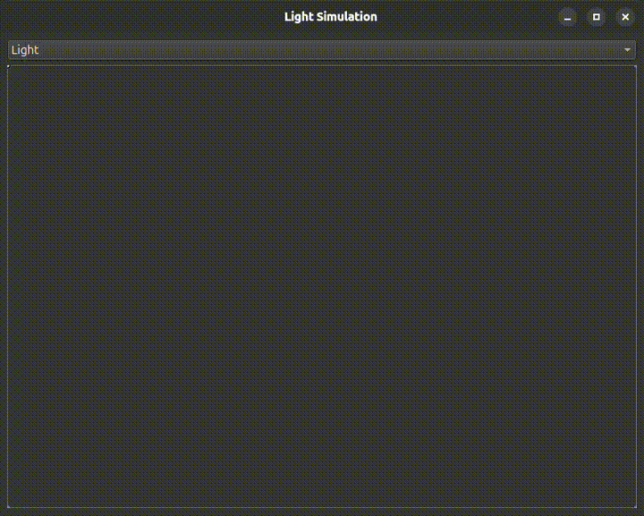

# 2D Raycaster: Симуляция Света и Тени

Это приложение на C++ и Qt, демонстрирующее 2D-трассировку лучей для создания динамических эффектов света и тени в реальном времени.

## Демонстрация



## Основные возможности

-   **Интерактивное рисование препятствий:** Рисуйте полигоны на холсте, которые будут отбрасывать тени.
-   **Динамический источник света:** Перемещайте источник света мышью и наблюдайте, как тени меняются в реальном времени.
-   **Эффект полутени (Penumbra):** Мягкие края теней создаются для большего реализма.
-   **Темная тема интерфейса:** Приятный для глаз UI, созданный с помощью палитры Qt.

## Технологический стек

-   **C++17**
-   **Qt 6** (Widgets, Gui, Core)
-   **CMake** для сборки проекта

## Управление

1.  Запустите приложение.
2.  Выберите режим в выпадающем списке:
    -   **Режим "Polygons" (Рисование):**
        -   **ЛКМ:** Начать новый полигон или добавить точку к текущему.
        -   **ПКМ:** Завершить рисование полигона.
    -   **Режим "Light" (Свет):**
        -   **Перемещение мыши:** Установить положение источника света.

### Сборка```bash
git clone https://github.com/daniladikan2000/2D_Raycaster.git
cd 2D_Raycaster
mkdir build && cd build
cmake ..
make
```
Для Windows или нестандартных путей Qt смотрите `CMakeLists.txt` или используйте `cmake-gui`.
